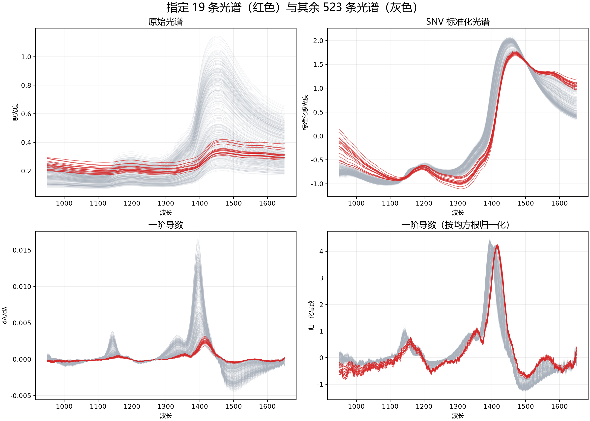
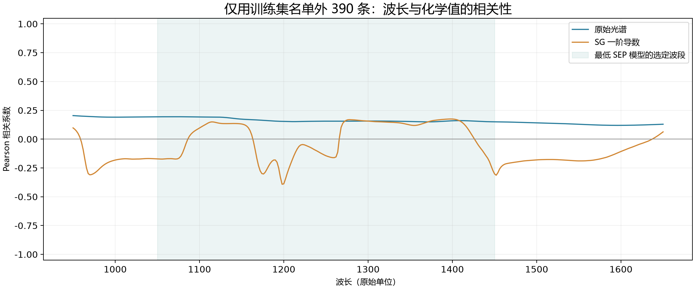
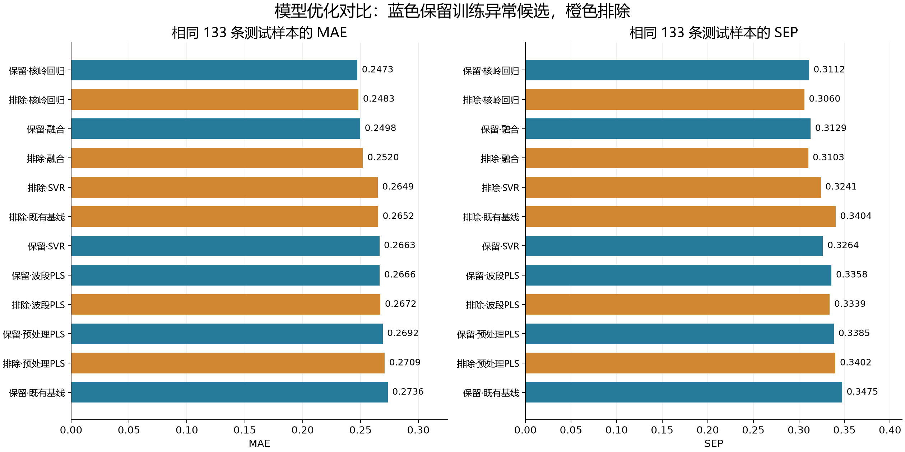
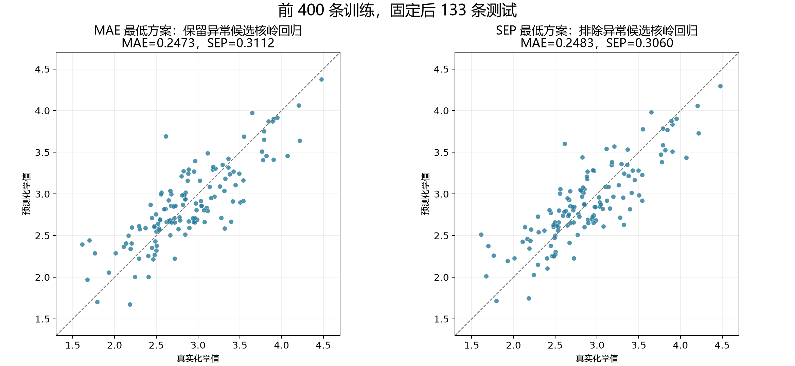

# 近红外光谱建模过程与复现说明

本说明记录从光谱与化学值匹配、异常候选处理、前400条模型优化，到使用全部合格样本重训并预测验证集的完整过程。最终提交方案为：排除指定19条候选，采用SG一阶导数、1050–1450区间和RBF核岭回归，以523条样本拟合，预测验证集136条。

## 1 数据来源与编号匹配

建模集包含1–542号光谱，每条CSV为351行、2列：第一列为光谱横坐标，第二列为吸光度。横坐标950–1650，间隔2。文件未明确标注单位，本报告沿用原始坐标数值。化学值来自“建模集化学成分.xlsx”，按第一列样本编号关联第二列数值，不依赖文件系统排序或表格行位置。

读取时检查编号完整且不重复、光谱与化学值一一对应、所有光谱网格一致，以及吸光度和化学值均为有限数。最终预测文件按验证集编号1–136输出，化学值和预测值保持源表尺度，不另行换算单位。

## 2 开发阶段与最终提交阶段

|阶段|使用样本|用途|
|---|---|---|
|优化训练|1–400号；保留400条或排除10条后390条|预处理、波段、算法及参数比较|
|开发对照|401–542号共142条；排除9条后133条|比较冻结模型的预测误差|
|最终训练|全部542条排除19条后523条|固定配置重新拟合|
|验证集预测|验证集文件夹1–136号|输出参赛预测值，无真实化学值|

这里的133条指401–542号排除9条后的集合，并非编号410–542，也不是验证集136条。最终重训时，这133条已进入523条训练数据，因此此前的133条指标不能当作最终523条模型的独立测试精度。

开发对照中，排除方案核岭模型MAE为0.248252、SEP为0.306031；保留方案核岭模型MAE略低，为0.247312。本次依据用户要求排除候选，并结合排除方案较低的SEP及RMSEP，选定区间核岭作为最终提交方法。“最优”仅限本次候选和已观察数据。

# 异常候选处理与适用范围

## 3 指定19条候选的处理

排除编号为33、166、226、294、350、351、352、374、375、376、460、461、462、463、494、495、496、520、521。其中前400条包含10条，后142条包含9条。名单由用户根据图形目视选出，尚无测量故障记录证明其全部为错误数据。最终按用户指定名单剔除，不额外扩大剔除范围。

这些样本在导数1374附近的下凹、主峰位置及长波段形态上呈现群体差异。其主导数峰多在1414–1416，其他样本较多在1394–1412；SNV后的长波段尾部也有差异。18/19条的最近邻仍在该组内，提示异常类型可能成组出现，单纯依赖最近邻距离会漏检。

图1 19条候选与其他建模光谱的原始、SNV及导数形态对照。红色用于突出候选组；形态差异本身不能证明化学标签有误或仪器故障。

剔除后的评估更接近“非名单样本”的适用范围，不能推断该方法对被剔除类型也具有相同精度。验证集未发现同等强度的相似异常，136条全部保留并给出预测。

# 预处理与波段选择

## 4 SG一阶导数与标准化

最终预处理先对完整351点光谱作Savitzky–Golay一阶导数：窗口17点、多项式3阶、deriv=1、delta=2、axis=1、mode="interp"。局部多项式拟合可平滑噪声并计算斜率，一阶导数削弱常量基线差异，但不保证消除全部散射或仪器影响。

随后保留1050≤横坐标≤1450的201个变量。必须先全谱计算导数再裁切；若先裁切再求导，区间边缘的窗口条件会改变，结果无法完全复现。对于核岭模型，每列用训练样本均值和总体标准差标准化，标准差小于1×10⁻¹²时置1；目标化学值同样使用训练均值和标准差标准化，预测后恢复原尺度。最终模型不额外进行SNV或MSC。

## 5 波段由训练交叉验证选择

先比较全波段预处理，再对各策略较优的3种预处理搜索连续区间。候选边界为950、1050、1150、1250、1350、1450、1550、1650；较优2种预处理还比较两个不相邻100单位区间的组合。相关系数图只用于解释，区间取舍由训练交叉验证误差决定，不以单点相关性高低直接裁切。

图2 前400条排除10条后的390条样本中，光谱变量与化学值的相关性。阴影标出1050–1450区间。单变量相关性不能代表多变量或非线性模型的全部预测信息。

# 模型搜索与最终算法

## 6 交叉验证与候选搜索

两种训练策略复用3次重复5折划分，随机种子20260918、20260919、20260920。主CV评分在名单外共同390条样本上计算，使其对应133条开发对照的目标范围；保留策略可在各训练折使用名单内样本，验证折样本不进入拟合。MSC参考谱、列标准化及目标标准化仅由各折训练数据计算。

共比较28种预处理：原始、数值一阶导数、SNV、MSC、线性去趋势、SNV加去趋势；SG平滑窗口9/17/25（2阶）；SG一阶窗口7/11/17/25/35与2/3阶组合；SG二阶窗口11/17/25（3阶）；SNV或MSC叠加SG一阶窗口11/17/25（2阶）。PLS潜变量数搜索1–25。

非线性搜索使用训练CV筛出的两个较优特征方案及最佳全谱方案。RBF-SVR比较C=1/10/100、epsilon=0.03/0.1；核岭比较alpha=0.001/0.01/0.1/1。两者gamma均比较0.01/0.1/1/10除以变量数。SVR的epsilon位于标准化目标尺度。另比较最佳PLS、SVR、核岭的两两25%/50%/75%加权及三模型等权融合，权重依据训练折外预测选择。

总计7212组训练CV配置。每种策略冻结基线、预处理PLS、波段PLS、SVR、核岭、融合各1个，共12个候选，再预测相同133条开发对照；未根据这次对照继续扩展参数搜索。完整候选配置和CV结果随源代码包附带。

## 7 RBF核岭回归的计算

令z为标准化后的201维导数特征，t为标准化化学值。核函数Kᵢⱼ=exp(−γ‖zᵢ−zⱼ‖²)；通过c=(K+αI)⁻¹t获得系数；新样本预测为ŷ=μᵧ+σᵧΣᵢcᵢ exp(−γ‖z−zᵢ‖²)。实现使用线性方程求解，不显式求逆。

|最终固定项|数值|
|---|---|
|算法|RBF核岭回归 KRR|
|SG导数|窗口17；3阶；一阶导数；步长2|
|变量区间|1050–1450，含两端，共201点|
|alpha|0.001|
|gamma|0.1/201 = 0.000497512437811|
|最终训练样本|523条；固定剔除19条|

alpha控制正则化强度，gamma控制核相似度随距离的衰减。区间和参数先锁定，再使用全部523条重算均值、标准差和核系数；未用验证集136条拟合任何标准化参数。

# 预测误差与候选比较

## 8 指标定义

设eᵢ=ŷᵢ−yᵢ，n为评价样本数。MAE=Σ|eᵢ|/n；Bias=Σeᵢ/n；SEP=√[Σ(eᵢ−Bias)²/(n−1)]；RMSEP=√[Σeᵢ²/n]；R²=1−Σeᵢ²/Σ(yᵢ−ȳ)²。SEP扣除了平均偏差，与RMSEP不同。本次未利用开发对照Bias校正预测。

|冻结候选|训练数|MAE|SEP|
|---|---|---|---|
|保留 核岭回归|400|0.247312|0.311163|
|排除 核岭回归|390|0.248252|0.306031|
|保留 融合|400|0.249755|0.312856|
|排除 融合|390|0.252027|0.310267|
|排除 SVR|390|0.264900|0.324147|
|排除 既有基线|390|0.265245|0.340408|
|保留 SVR|400|0.266326|0.326389|
|保留 波段PLS|400|0.266563|0.335827|
|排除 波段PLS|390|0.267207|0.333861|
|保留 预处理PLS|400|0.269156|0.338549|
|排除 预处理PLS|390|0.270876|0.340158|
|保留 既有基线|400|0.273567|0.347452|

表1 相同133条开发对照样本上的结果。排除核岭（C07101）的RMSEP=0.304945、Bias=0.006392、R²=0.699967；相比排除基线PLS，MAE下降6.41%，SEP下降10.10%。保留核岭的MAE小0.000940，未检验其统计显著性，因此不能声称剔除一定更好。

训练CV最低的是排除融合方案C07207，CV MAE=0.215483；其开发对照MAE=0.252027，并非最低。最终排除核岭的CV MAE=0.233366、CV RMSE=0.300746。这说明训练内部排序与开发对照排序并不完全一致。

“波段选择有效”也不能泛化：区间PLS未超过原排除基线的MAE；核岭才在该比较中带来更清晰改善。最低MAE核岭仍使用全谱，区间核岭在SEP/RMSEP上较好。

# 预测结果图形比较

图3 冻结12个模型在同一133条样本上的MAE和SEP，数值越低越好。

图4 两个核岭优选方案的预测值与真实化学值对比。散点接近对角线表示预测较接近实测；图中指标属于开发阶段400/390条训练的模型，不属于最终523条模型的外部验证。

# 最终重训与源代码复现

## 9 全部合格样本重训与验证集预测

将全部542条光谱和化学值按编号关联，删除指定19条得到523条。固定SG、区间、alpha和gamma，重新拟合列均值/标准差、目标均值/标准差与核岭系数，保存“最终模型_523条_区间核岭.joblib”。对验证集136条采用同样的SG与区间处理，调用训练得到的标准化参数，输出恢复到原化学值尺度的预测。

验证集136条预测范围为1.728158–4.232767。结果CSV保留10位小数，已填写参赛附表保留6位小数；数值精度显示位数不代表测量或预测实际精度。验证集没有真实化学值，未计算其MAE、SEP或R²。

## 10 源代码组成与运行方法

代码包含独立复现脚本reproduce_final_model_standalone.py，以及实际搜索脚本optimize_spectral_models.py、算法核心spectral_optimization_core.py、数据读取train_first400_compare.py、最终重训train_submission_model.py、预测入口和汇总绘图代码。保留完整优化日志、冻结模型配置、指标表及作图数据，便于追溯。

安装requirements.txt后，在包含建模集、验证集和建模集化学成分.xlsx的目录运行：python reproduce_final_model_standalone.py --data-dir . --output-dir reproduction。独立脚本固定最终参数，只进行523条重训和136条预测，不重复7212组搜索；--compare-csv可指定此前结果文件作数值核验。完整搜索及其耗时提示见代码包运行说明。

独立脚本使用scikit-learn KernelRidge重算，与原先SciPy线性求解实现的136条预测比较，最大绝对差为5.58e-11，通过1×10⁻⁸容差检查。两种实现数值一致，输出没有覆盖原始数据。

## 11 结果解释与后续验证

133条开发对照曾在此前分析中多次查看，本次又用于比较冻结模型并确定提交方案；它不是盲测外部验证集。7212组筛选后的训练CV同样可能带有选择乐观偏差，本次没有执行独立外层嵌套CV。最终准确度应由未参与选择、具有真实化学值的新样本确认。

如有同一样本重复测量、采样批次或仪器标识，后续应以样本或批次分组划分，检查跨批次稳定性。本次未获得可供分组的明确记录。19条候选可能代表不同样本类型，保留测量记录并复测可帮助判断是否属于仪器或标签错误。

附件包含8张PNG图表、模型比较CSV及133条预测明细。07和08为此前全谱数值一阶导数展示图，用于光谱观察；最终模型采用本报告规定的SG一阶导数，二者不可混用。
